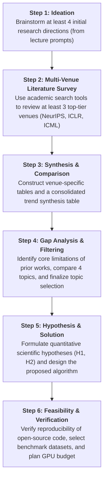

# DAY 2 REPORT
**Course:** Scientific Method  
**Topic:** Adaptive Test-Time Compute Allocation via Optimal Stopping for Mathematical Reasoning  
**Student:** Do Gia Huy  
---

## 1. Research Objectives & Scientific Workflow
### 1.1. Core Objective (What do we want to achieve?)
Address the problem of **Test-Time Compute Efficiency** for Large Language Models (LLMs) in mathematical reasoning tasks:
- Currently, techniques such as *Self-Consistency* or *Best-of-N* force the model to generate a fixed number of reasoning chains ($N = 16$ or $N = 40$) for every query, wasting 60% to 80% of tokens on easy problems.
- The objective of this project is to develop a **Calibrated Sequential Optimal Stopping (CS-OS)** algorithm: Easy problems only require 1–2 samples before early stopping is triggered, whereas hard problems utilize the maximum sampling budget ($N_{\max}$). This achieves **40% – 60% token savings** while **maintaining or slightly improving accuracy (Pass@1)**.

### 1.2. Scientific Workflow
Adhering strictly to the scientific research methodology taught in class:



1. **Idea Exploration (Brainstorming):** Propose 4 candidate research directions from initial course recommendations (Anomaly Detection, Multimodal RAG, Continual Learning, Test-Time Compute Allocation).
2. **Academic Literature Search:** Utilize academic search tools (*OpenReview, arXiv, Google Scholar, Semantic Scholar*) to review papers across 3 top-tier conferences: **NeurIPS**, **ICLR**, and **ICML/EMNLP**.
3. **Statistical Synthesis & Comparison:** Construct detailed comparison tables for each conference and a consolidated multi-venue trend analysis table.
4. **Research Gap Analysis:** Identify core bottlenecks in prior studies and justify the final topic selection.
5. **Hypothesis Formulation & Solution Design:** Formulate quantitatively verifiable scientific hypotheses ($H_1, H_2$) and design the proposed CS-OS algorithm.
6. **Feasibility Assessment:** Verify the reproducibility of open-source codebases, select standardized benchmark datasets (GSM8K, MATH-500), and calculate feasible GPU requirements for the 2.5-month timeline.

---
## 2. Multi-Venue Top-Tier Literature Survey & Consolidated Synthesis

We conducted a systematic literature survey across 3 premier venues using academic search engines (*OpenReview, arXiv, Google Scholar, Semantic Scholar*):

> 📄 **Extended Literature Survey:** The complete taxonomy of 24 verified papers categorized by international academic rankings CORE A*, A, and Journal Q1 (including official links, open-source repositories, and in-depth limitation analyses) is documented in [Related_Papers.md](file:///d:/Courses/Scientific%20Method/Related_Papers.md).

### 2.1. Table 1: NeurIPS (Conference on Neural Information Processing Systems)

| No. | Paper Title & Authors | Year | Paper Link | Source Code (GitHub) | Core Technical Approach | Key Contributions | Limitations |
| :---: | :--- | :---: | :---: | :---: | :--- | :--- | :--- |
| 1 | **Large Language Monkeys: Scaling Inference Compute with Repeated Sampling**<br>*(Brown et al. - Stanford)* | 2024 | [arXiv:2407.21787](https://arxiv.org/abs/2407.21787) | [large_language_monkeys](https://github.com/ScalingIntelligence/large_language_monkeys) *(Official)* | Repeated Sampling & Coverage Scaling | Proves that repeated sampling with large $N$ solves competition-level math problems; provides an official open-source codebase. | Employs a massive static sampling budget ($N=10^3 \dots 10^4$), causing enormous token overhead; relies on a perfect verifier (primarily effective for code/formal proof). |
| 2 | **Tree of Thoughts: Deliberate Problem Solving with Large Language Models**<br>*(Yao et al. - Princeton)* | 2023 | [arXiv:2305.10601](https://arxiv.org/abs/2305.10601) | [tree-of-thought-llm](https://github.com/princeton-nlp/tree-of-thought-llm) *(Official)* | Tree Search (BFS/DFS) over Thought Spaces | Enables LLMs to evaluate intermediate reasoning steps, explore multiple branches, and backtrack. | High inference latency and slow generation speed; cumbersome search tree structure difficult to scale to high-volume question sets. |
| 3 | **Self-Refine: Iterative Refinement with Self-Feedback**<br>*(Madaan et al. - CMU)* | 2023 | [arXiv:2303.17651](https://arxiv.org/abs/2303.17651) | [madaan/self-refine](https://github.com/madaan/self-refine) *(Official)* | Test-Time Iterative Self-Feedback & Multi-Turn Refinement | Demonstrates that LLMs can iteratively improve mathematical and reasoning outputs at inference time through self-feedback without retraining. | Fixed multi-turn iteration loop multiplies token overhead by 2x–4x; lacks statistical stopping criteria to halt when answers are already optimal. |
| 4 | **Measuring Mathematical Problem Solving With the MATH Dataset**<br>*(Hendrycks et al. - UC Berkeley)* | 2021 | [arXiv:2103.03874](https://arxiv.org/abs/2103.03874) | [hendrycks/math](https://github.com/hendrycks/math) *(Official)* | Standardized Multi-Tier Math Benchmark | Created the premier 12,500-problem benchmark across 7 subjects and 5 difficulty levels; foundation of the MATH-500 testbed used across all test-time compute papers. | Complex LaTeX formatting variability requires symbolic normalizers (`sympy`/`math_verify`); baseline evaluation uses static greedy sampling without compute adaptation. |

### 2.2. Table 2: ICLR (International Conference on Learning Representations)

| No. | Paper Title & Authors | Year | Paper Link | Source Code (GitHub) | Core Technical Approach | Key Contributions | Limitations |
| :---: | :--- | :---: | :---: | :---: | :--- | :--- | :--- |
| 1 | **Self-Consistency Improves Chain of Thought Reasoning in Language Models**<br>*(Wang et al. - Google)* | 2023 | [arXiv:2203.11171](https://arxiv.org/abs/2203.11171) | *(Community)* [chain-of-thought-hub](https://github.com/FranxYao/chain-of-thought-hub) | Parallel Sampling & Majority Voting | Pioneered ensemble test-time reasoning; significantly boosted accuracy on GSM8K and SVAMP. | Fixed sampling budget (e.g., $N=40$) for all inputs, wasting 80–90% of tokens on basic questions. |
| 2 | **Escape Sky-high Cost: Early-stopping Self-Consistency for Multi-step Reasoning**<br>*(Li et al.)* | 2024 | [arXiv:2401.10480](https://arxiv.org/abs/2401.10480) | [Yiwei98/ESC](https://github.com/Yiwei98/ESC) *(Official)* | Early-Stopping Self-Consistency (ESC) | Proposed adaptive early-stopping based on sliding window consensus; reduced samples by 80.1% on GSM8K and 33.8% on MATH. | Solely relies on outcome voting frequency; prone to false early exits when encountering common error paths (overconfident errors). |
| 3 | **Scaling LLM Test-Time Compute Optimally can be More Effective than Scaling Parameters for Reasoning**<br>*(Snell et al. - Berkeley/Google)* | 2025 | [arXiv:2408.03314](https://arxiv.org/abs/2408.03314) | [Awesome-Efficient-Reasoning](https://github.com/hemingkx/Awesome-Efficient-Reasoning) *(No official repo)* | Compute-Optimal Search (PRM + BoN) | Formulated trade-off scaling laws: Verifier-guided test-time compute can equate to a 14x increase in model parameters. | Lacks an online sequential stopping algorithm that adaptively halts per instance during sample generation. |
| 4 | **Let's Verify Step by Step**<br>*(Lightman et al. - OpenAI)* | 2024 | [arXiv:2305.20050](https://arxiv.org/abs/2305.20050) | [openai/prm800k](https://github.com/openai/prm800k) *(Official)* | Process-Supervised Reward Models (PRM800K) | Demonstrated that step-level PRMs outperform ORMs; released 800k human-labeled reasoning step dataset. | Step-level PRM scoring is compute-heavy during full tree search (MCTS); lacks an adaptive stopping threshold. |

### 2.3. Table 3: ACL & EMNLP (Top-Tier Natural Language Processing Conferences)

| No. | Paper Title & Authors | Year | Paper Link | Source Code (GitHub) | Core Technical Approach | Key Contributions | Limitations |
| :---: | :--- | :---: | :---: | :---: | :--- | :--- | :--- |
| 1 | **Math-Shepherd: Verify and Reinforce LLMs Step-by-step without Human Annotations**<br>*(Wang et al. - Peking/DeepSeek)* | ACL 2024 | [ACL Anthology](https://aclanthology.org/2024.acl-long.510/) | [peiyi9979/Math-Shepherd](https://huggingface.co/datasets/peiyi9979/Math-Shepherd) *(Data)* | Automated Step-Level PRM via Monte Carlo Rollouts | Eliminates human labeling bottleneck in PRM training via automated rollouts; establishes premier open-source step-level verifier for math reasoning. | Monte Carlo labeling can assign false-positive scores when intermediate errors cancel out; unintegrated with dynamic stopping at inference time. |
| 2 | **Active Prompting with Chain-of-Thought for Large Language Models**<br>*(Diao et al. - HKUST)* | ACL 2024 | [ACL Anthology](https://aclanthology.org/2024.acl-long.122/) | [shizhediao/active-prompt](https://github.com/shizhediao/active-prompt) *(Official)* | Uncertainty-Based Disagreement & Metric Selection | Introduces metrics (disagreement, entropy) across sampled reasoning paths to measure model uncertainty and question difficulty dynamically. | Primarily designed for exemplar selection in prompt design; lacks real-time sequential stopping thresholds during online sampling. |
| 3 | **Let's Sample Step by Step: Adaptive-Consistency for Efficient Reasoning and Coding with LLMs**<br>*(Aggarwal et al. - CMU)* | EMNLP 2023 | [ACL Anthology](https://aclanthology.org/2023.emnlp-main.761/) | [sample-step-by-step.info](https://sample-step-by-step.info) *(Official)* | Adaptive-Consistency & Early Stopping | Halts sampling when the vote margin between top-1 and top-2 candidates exceeds a safety threshold; cuts sample counts by 4.2x–7.9x. | Relies solely on outcome voting; lacks step-level process reward models (PRM) to validate intermediate reasoning chains. |
| 4 | **Reasoning with Language Model is Planning with World Model (RAP)**<br>*(Hao et al. - UCSD/CMU)* | EMNLP 2023 | [ACL Anthology](https://aclanthology.org/2023.emnlp-main.504/) | [Ber666/rap](https://github.com/Ber666/rap) *(Official)* | Monte Carlo Tree Search (MCTS) as Test-Time Planning | Adapts LLMs to deliberate System-2 reasoning using MCTS; dynamically explores alternative reasoning trajectories and balances exploration with exploitation. | Incurs hundreds of simulation rollouts per question; extreme token cost and high inference latency render it impractical for budget-constrained reasoning. |

---

### 2.4. Table 4: Consolidated Trend Synthesis Across Venues (Merged Trends & Analysis)

| Approach Family | Survey Share | Representative Works | Budget Allocation Mechanism | Primary Objective | Key Bottleneck |
| :--- | :---: | :--- | :--- | :--- | :--- |
| **Fixed-Budget Sampling** | **25.0%** | *Self-Consistency (ICLR'23)*<br>*Large Language Monkeys (NeurIPS'24)* | Static budget ($N = 16, 40, 1000$) across all questions | Maximize Accuracy (Pass@1) | Severe token waste on easy queries; diminishing returns. |
| **Step-Level Verification (PRM)** | **25.0%** | *Lightman et al. (ICLR'24)*<br>*Math-Shepherd (ACL'24)* | Step-by-step scoring via PRM | Identify the most accurate reasoning chain | Continuous PRM evaluation induces prohibitive GPU cost under full tree search. |
| **Early Stopping & Adaptive Sampling** | **25.0%** | *ESC (ICLR'24)*<br>*Adaptive-Consistency (EMNLP'23)* | Sliding consensus window / Vote margin | Drastically reduce generated sample count | Outcome-frequency-only stopping; susceptible to overconfident incorrect paths. |
| **Search & Deliberate Planning** | **25.0%** | *Tree of Thoughts (NeurIPS'23)*<br>*RAP (EMNLP'23)*<br>*Self-Refine (NeurIPS'23)* | Tree search (BFS/DFS/MCTS) / Multi-turn refinement | Explore complex reasoning spaces | High latency, excessive simulation rollouts, and lack of dynamic early exit. |

---

## 3. Technical Related Works & Limitations / Research Gaps

### 3.1. Technical Related Works
1. **Parallel Sampling & Majority Voting:**
   - *Self-Consistency* (Wang et al., 2023): Generates $N$ independent reasoning chains, selecting the majority vote $\hat{a} = \arg\max_a \sum_{i=1}^N \mathbb{I}(\text{ans}(y_i) = a)$.
2. **Step-Level Verification via Process Reward Models (PRMs):**
   - *PRM800K* (Lightman et al., 2024) and *Math-Shepherd* (Wang et al., 2024): Evaluates step reliability $s_t$, aggregating sequence score $R_{\text{PRM}}(y) = \min_t r_t$.
3. **Adaptive Stopping & Deliberate Search:**
   - *Early-Stopping Self-Consistency (ESC)* (Li et al., 2024) & *Adaptive-Consistency* (Aggarwal et al., 2023): Halts sampling early based on sliding consensus windows or top-1/top-2 margin boundaries.
   - *Tree of Thoughts* (Yao et al., 2023) & *RAP* (Hao et al., 2023): Explores intermediate reasoning states via tree search (BFS/DFS/MCTS).

### 3.2. Core Limitations & Research Gaps
1. **Issue 1: Uniform Budget Inefficiency on Easy Queries:**
   - The majority of questions in GSM8K (>60%) can be solved correctly with just 1 or 2 initial samples. Enforcing a static $N=16$ wastes ~80% of tokens and risks inducing overthinking errors.
2. **Issue 2: Premature Termination from Overconfident Error Paths:**
   - Existing early-stopping methods (ESC, Adaptive-Consistency) rely exclusively on outcome voting. When faced with tricky questions, the model often produces the same plausible wrong answer repeatedly, causing premature exit on incorrect answers.
3. **Issue 3: Absence of Training-Free Online Stopping Mechanisms:**
   - Recent budget allocation approaches (Snell et al. 2025, Zhai et al. 2026) require training auxiliary offline classifiers to predict budgets, lacking real-time adaptivity as individual samples are produced.

---

## 4. Proposed Direction & Technical Methodology

1. **Developing the CS-OS (Calibrated Sequential Optimal Stopping) Algorithm:**
   - Implement a lightweight Python wrapper module.
   - Sample sequentially in micro-batches ($b = 2$ chains/batch).
   - At each step $k$, compute two joint signals:
     - Signal 1: *Semantic Agreement Margin* between top-1 and top-2 candidates.
     - Signal 2: *Cumulative PRM Confidence Score* $\bar{R}_k(a^*) = \frac{1}{|S_{a^*}|} \sum_{i \in S_{a^*}} R_{\text{PRM}}(y_i)$.
   - If the stopping condition holds: $\text{Stopping Score}(a^*, k) \ge \tau(k)$, terminate generation immediately and output $a^*$.
2. **Experimental Benchmarking & Pareto Curve Analysis:**
   - Measure and plot the Pareto Frontier (Accuracy vs. Average Tokens per Question).
   - Direct comparison against 3 baselines: Greedy ($N=1$), Fixed Best-of-N ($N=4, 8, 16$), and Naive Early Exit (ESC).

---

## 5. Foundation Papers & Value Proposition

### 5.1. Directly Inherited Foundation Papers

| No. | Foundation Paper | Venue | Paper Link | Source Code (GitHub) | Inherited Role in Proposed Solution |
| :---: | :--- | :---: | :---: | :---: | :--- |
| 1 | **Self-Consistency Improves Chain of Thought Reasoning** *(Wang et al.)* | ICLR 2023 | [arXiv:2203.11171](https://arxiv.org/abs/2203.11171) | *(Community)* [chain-of-thought-hub](https://github.com/FranxYao/chain-of-thought-hub) | Inherits multi-chain CoT generation framework and majority voting mechanism. |
| 2 | **Escape Sky-high Cost: Early-stopping Self-Consistency** *(Li et al.)* | ICLR 2024 | [arXiv:2401.10480](https://arxiv.org/abs/2401.10480) | [Yiwei98/ESC](https://github.com/Yiwei98/ESC) *(Official)* | Inherits sliding consensus window mechanism for early stopping. |
| 3 | **Let's Sample Step by Step: Adaptive-Consistency** *(Aggarwal et al.)* | EMNLP 2023 | [ACL Anthology](https://aclanthology.org/2023.emnlp-main.761/) | [sample-step-by-step.info](https://sample-step-by-step.info) *(Official)* | Inherits vote margin differential formula (top-1 vs top-2). |
| 4 | **Let's Verify Step by Step** *(Lightman et al. - OpenAI)* | ICLR 2024 | [arXiv:2305.20050](https://arxiv.org/abs/2305.20050) | [openai/prm800k](https://github.com/openai/prm800k) *(Official)* | Inherits step-level Process Reward Model (PRM) as confidence scoring function. |
| 5 | **Scaling LLM Test-Time Compute Optimally** *(Snell et al.)* | ICLR 2025 | [arXiv:2408.03314](https://arxiv.org/abs/2408.03314) | [Awesome-Efficient-Reasoning](https://github.com/hemingkx/Awesome-Efficient-Reasoning) *(No official repo)* | Inherits methodology for evaluating Pareto optimality. |

### 5.2. Problem Solved: Accuracy Improvement or Cost Reduction?
- **Primary Goal: COST REDUCTION (Tokens & Latency):**
  - Reduce total tokens generated on GSM8K and MATH-500 by **40% to 60%** compared to a fixed $N=16$ strategy.
- **Secondary Goal: ACCURACY PRESERVATION (Slight Gain):**
  - Maintain accuracy ($\pm 0.5\% - 1.5\%$) Pass@1 / Majority Vote parity with fixed Best-of-16.
  - Eliminate premature stopping on deceptive errors via PRM verification.
- **Summary:** Achieve an optimal Pareto point (highest accuracy at lowest token cost).

---

## 6. Scientific Hypotheses & Proposed Solution

### 6.1. Scientific Hypotheses
- **Hypothesis $H_1$ (Reliability of Joint Stopping Criterion):**
  > *If a candidate answer achieves high consensus among initial reasoning paths and simultaneously receives a high average score from a Process Reward Model ($R_{\text{PRM}} > \theta$), the probability that the answer is correct approaches $1.0 - \epsilon$ ($\epsilon < 0.03$). Consequently, early stopping based on this joint criterion will not degrade overall accuracy.*
- **Hypothesis $H_2$ (Pareto Frontier Optimization):**
  > *By liberating 60–70% of the token budget from easy questions via optimal stopping, the algorithm can match the accuracy of Best-of-16 while incurring an average cost comparable to Best-of-4 to Best-of-6.*

### 6.2. Proposed Solution: CS-OS Algorithm

```python
# Pseudo-code for Calibrated Sequential Optimal Stopping (CS-OS)
def CS_OS(question, llm, prm, N_max=16, batch_size=2, tau=0.85):
    samples = []
    scores = {}
    
    for k in range(batch_size, N_max + 1, batch_size):
        # 1. Generate b new reasoning paths
        new_samples = llm.generate(question, n=batch_size, temperature=0.7)
        for s in new_samples:
            ans = extract_answer(s)
            prm_score = prm.score_steps(question, s)  # Min-form step score
            samples.append((ans, prm_score))
            scores[ans] = scores.get(ans, 0) + prm_score
            
        # 2. Identify top-1 and runner-up candidates
        sorted_candidates = sorted(scores.items(), key=lambda x: x[1], reverse=True)
        top_ans, top_score = sorted_candidates[0]
        second_score = sorted_candidates[1][1] if len(sorted_candidates) > 1 else 0
        
        # 3. Calculate calibrated joint confidence margin
        margin = (top_score - second_score) / (sum(scores.values()) + 1e-6)
        
        # 4. Check Optimal Stopping condition
        if margin >= tau or (len(samples) >= 4 and top_score / len(samples) > 0.9):
            return top_ans  # SUCCESSFUL EARLY EXIT
            
    # 5. If reaching N_max: Return highest scoring candidate
    return sorted_candidates[0][0]
```

---

## 7. Source Code Reproducibility & Anti-Over-Engineering
### 7.1. Survey of Open-Source Repositories
All components required for this research are publicly available, transparent, and immediately executable:
1. **Baseline Evaluation Pipeline:** [`FranxYao/chain-of-thought-hub`](https://github.com/FranxYao/chain-of-thought-hub) (Clean implementation with established GSM8K and MATH parsers).
2. **Comparative Early Stopping Baseline:** [`Yiwei98/ESC`](https://github.com/Yiwei98/ESC) (Official code from ICLR 2024).
3. **Process Reward Model:** Open-source checkpoint [`Qwen/Qwen2.5-Math-PRM-7B`](https://huggingface.co/Qwen/Qwen2.5-Math-PRM-7B) by Alibaba.
4. **Inference Acceleration Engine:** [`vLLM`](https://github.com/vllm-project/vllm) (PagedAttention for fast inference, installable via `pip install vllm`).

### 7.2. Avoiding Over-Engineering Traps
- **No Distributed Training:** Avoids cumbersome DeepSpeed or Ray cluster setup.
- **No RL from Scratch:** Bypasses complex, memory-leak-prone multi-agent PPO pipelines.
- **Extremely Lightweight Implementation:** The CS-OS algorithm is a Python wrapper (~50 lines of code) interfacing with vLLM outputs to trigger early exits. Any student or instructor can replicate the experiment with a single script execution.

---

## 8. Datasets & GPU Compute Plan

### 8.1. Experimental Datasets

| Dataset | Test Size | Problem Characteristics | Difficulty | Evaluation Metric |
| :--- | :---: | :--- | :---: | :--- |
| **GSM8K** *(Cobbe et al.)* | 1,319 test samples | Grade-school arithmetic, 2–8 reasoning steps | Easy – Medium | Integer regex extraction (Exact Match) |
| **MATH-500** *(Lightman et al.)* | 500 test samples | High-school competition math (Algebra, Geometry, Combinatorics) | Hard (Level 1 $\rightarrow$ 5) | `sympy` / `math_verify` symbolic normalization |
| **SVAMP** *(Patel et al.)* | 1,000 test samples | Word problem variations testing sensitivity to trick questions | Medium | Exact Match arithmetic |

*Advantages:* Fully public, standardized JSONL format, 100% verified ground truth.

### 8.2. GPU Configurations & 4 Feasible Execution Strategies on 8GB VRAM

1. **Strategy 1: Using Small Models (1.5B/3B) for Algorithm Debugging**
   - **Models:** `Qwen2.5-Math-1.5B` or `DeepSeek-R1-Distill-Qwen-1.5B`.
   - **VRAM Analysis:** Running in native FP16/BF16 consumes only **~3.0 GB VRAM**, leaving 5GB available for KV Cache.
   - **Advantage:** Rapid generation speed (>80 tokens/s). Ideal for development, validating early stopping loop logic, and debugging without wait times.

2. **Strategy 2: 4-bit Quantization for 7B Models**
   - **Model:** `Qwen2.5-Math-7B-Instruct` (AWQ or GGUF Q4_K_M format).
   - **VRAM Analysis:** 4-bit weights consume **~4.2 GB VRAM**. With a small batch size ($b=1$ or $b=2$), KV Cache and CUDA overhead take ~1.5 GB. Total consumption is **~5.7 GB VRAM**, running smoothly on an RTX 4060 (8GB).

3. **Strategy 3: Pipeline Sequential Execution for Generator and PRM**
   - **Challenge:** Loading both Generator 7B (4.2GB) and PRM 7B (4.2GB) simultaneously into 8GB VRAM triggers Out-Of-Memory (OOM).
   - **Solution:** Sequential pipeline design: Load Generator $\rightarrow$ generate reasoning paths (save to system RAM) $\rightarrow$ unload Generator from GPU (free VRAM) $\rightarrow$ load PRM $\rightarrow$ score steps. 100% memory optimal.

4. **Strategy 4: Leveraging Free Cloud Resources for Final Benchmarking**
   - **Solution:** Utilize **Kaggle Notebooks** (2x GPU T4 16GB VRAM, free 30 hrs/week) or **Google Colab Free** (1x GPU T4 16GB).
   - **Advantage:** Once code is fully debugged locally, run batch evaluation over MATH-500 overnight on Kaggle to produce final report metrics without thermal stress on local hardware.

**Estimated Real-World Runtime on RTX 4060:**
- Parallel throughput of 7B (4-bit) via vLLM / Ollama: **~40 tokens/sec**.
- Under CS-OS, average sample count on GSM8K drops from 16 to ~5.2 samples.
- Evaluating all 1,319 GSM8K queries on a laptop takes approximately **8 to 9 hours** (executable overnight).
- **Total GPU cost for the entire project: $0 USD** (100% local workstation and free tier cloud).
