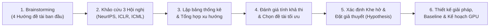
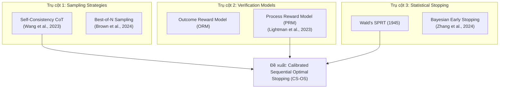
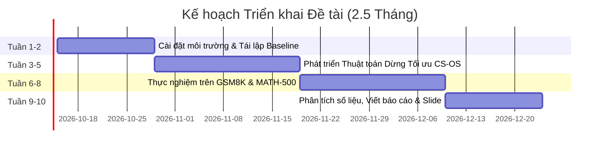

# BÁO CÁO NGHIÊN CỨU KHOA HỌC (DAY 2)
**Học phần:** Phương pháp Nghiên cứu Khoa học (Scientific Method)  
**Đề tài chính thức lựa chọn:** Adaptive Test-Time Compute Allocation via Optimal Stopping for Mathematical Reasoning  
**Sinh viên thực hiện:** [Họ và tên sinh viên / MSSV]  
**Thời gian thực hiện dự kiến:** 2.5 tháng  

---

## 1. Mục tiêu & Các thao tác nghiên cứu chuẩn (Research Workflow)

Theo phương pháp luận nghiên cứu khoa học được giảng dạy trên lớp, quy trình xây dựng báo cáo lớn và xác định đề tài được tiến hành qua 6 bước tuần tự, có hệ thống:



1. **Khám phá ý tưởng (Ideation):** Đề xuất ít nhất 4 hướng nghiên cứu tiềm năng dựa trên sở thích cá nhân và các bài toán nóng trong AI.
2. **Khảo sát tài liệu đa hội nghị (Multi-conference Literature Survey):** Sử dụng các công cụ tìm kiếm học thuật (*Google Scholar, ArXiv, OpenReview, Semantic Scholar*) để rà soát các bài báo tại ít nhất 3 hội nghị Top-tier (NeurIPS, ICLR, ICML).
3. **Phân tích tổng hợp & So sánh (Comparative Synthesis):** Xây dựng bảng thống kê chi tiết cho từng hội nghị và bảng tổng hợp đa hội nghị để nhận diện các xu hướng kỹ thuật chủ đạo.
4. **Sàng lọc & Quyết định (Down-selection):** Phân tích 4 chủ đề dựa trên tiêu chí: tính mới, độ khó kỹ thuật, tính tái lập của mã nguồn, và tính khả thi về dữ liệu/GPU trong giới hạn 2.5 tháng.
5. **Xây dựng Giả thuyết Khoa học (Hypothesis Formulation):** Chỉ ra khe hở nghiên cứu (Research Gap), xây dựng giả thuyết khoa học có thể kiểm chứng định lượng ($H_1, H_2$).
6. **Đặc tả Kỹ thuật & Thực nghiệm:** Xác định kiến trúc giải pháp, baseline chuẩn mở, tập dữ liệu kiểm thử và phân bổ ngân sách GPU.

---

## 2. Khảo sát 4 chủ đề ban đầu & Quyết định lựa chọn

### 2.1. Danh mục 4 chủ đề xem xét ban đầu

1. **Chủ đề 1 (Ý định ban đầu trên lớp): Unsupervised Anomaly Detection trong Computer Vision (PatchCore / Diffusion)**
   - *Mô tả:* Phát hiện lỗi sản phẩm công nghiệp (bộ dữ liệu MVTec AD, VisA) chỉ dùng ảnh bình thường để huấn luyện.
   - *Ưu điểm:* Bài toán trực quan, ứng dụng công nghiệp rõ ràng; các mô hình chuẩn như PatchCore, FastFlow có sẵn mã nguồn.
   - *Nhược điểm:* Các phương pháp embedding-based hiện tại trên MVTec AD đã đạt ngưỡng bão hòa (AUROC > 99.5%). Các hướng mới chuyển sang Zero-shot Anomaly Detection với Vision-Language Model (WinCLIP) đòi hỏi tài nguyên lớn, ít dư địa cải tiến giải thuật cốt lõi trong ngắn hạn.

2. **Chủ đề 2: Multimodal Retrieval-Augmented Generation (RAG) giảm thiểu Hallucination**
   - *Mô tả:* Tích hợp tài liệu văn bản và sơ đồ/hình ảnh vào quy trình truy xuất để giảm thiểu ảo giác cho LLM/VLM.
   - *Ưu điểm:* Tính ứng dụng thực tế rất cao trong doanh nghiệp.
   - *Nhược điểm:* Phụ thuộc nặng vào chất lượng pipeline kỹ thuật (OCR, vector database chunking, retrieval latency). Khó cô lập đóng góp khoa học thuần túy vì tính trồi sụt của dữ liệu phi cấu trúc; khó kiểm soát biến ngẫu nhiên trong 2.5 tháng.

3. **Chủ đề 3: Parameter-Efficient Continual Learning cho Large Language Models**
   - *Mô tả:* Giữ tri thức cũ khi fine-tune LLM trên các miền tri thức mới liên tiếp bằng LoRA adapters động.
   - *Ưu điểm:* Chủ đề học thuật có tính nền tảng cao.
   - *Nhược điểm:* Huấn luyện nhiều vòng liên tiếp tốn kém tài nguyên tính toán (GPU compute bound); nguy cơ Catastrophic Forgetting khó đo lường chính xác nếu không huấn luyện trên cụm máy chủ lớn.

4. **Chủ đề 4 (Được chọn): Adaptive Test-Time Compute Allocation via Optimal Stopping for Mathematical Reasoning**
   - *Mô tả:* Tự động điều chỉnh số lượng chuỗi suy luận (sampling budget) linh hoạt cho từng câu hỏi: bài dễ dừng sớm, bài khó dồn tài nguyên suy nghĩ nhiều hơn thay vì lấy mẫu cố định (Best-of-N / Self-Consistency).
   - *Ưu điểm:* 
     - **Tính thời sự cực cao:** Đây là trọng tâm nghiên cứu hàng đầu hiện nay sau sự ra đời của các mô hình lý luận thế hệ mới (OpenAI o1, DeepSeek-R1).
     - **Thực nghiệm hoàn toàn trên pha Inference (Inference-time):** Không đòi hỏi pre-training hay full fine-tuning tốn kém hàng nghìn GPU; sinh viên có thể chạy trên 1 GPU cá nhân hoặc Google Colab với các mô hình 7B/8B mở.
     - **Tính đo lường toán học chặt chẽ:** Đánh giá trên GSM8K và MATH có ground-truth chính xác tuyệt đối (Pass@1, Exact Match), loại bỏ yếu tố đánh giá chủ quan.

### 2.2. Bảng tổng hợp so sánh 4 chủ đề (Summarize)

| Tiêu chí | Chủ đề 1: Anomaly Detection | Chủ đề 2: Multimodal RAG | Chủ đề 3: Continual Learning | Chủ đề 4: Adaptive Test-Time Compute (Được chọn) |
| :--- | :--- | :--- | :--- | :--- |
| **Tính thời sự (Novelty)** | Trung bình (đã bão hòa benchmark) | Cao (ứng dụng thực tế) | Cao (lý thuyết nền tảng) | **Rất cao (Tâm điểm 2024-2025)** |
| **Độ phức tạp kỹ thuật** | Trung bình | Phức tạp về mặt kỹ thuật hệ thống | Phức tạp về mặt huấn luyện mô hình | **Tập trung vào thuật toán ra quyết định** |
| **Nhu cầu GPU** | Thấp (1x GPU 8GB) | Trung bình (1x GPU 16GB) | Cao (Cụm 4-8x A100/V100) | **Vừa phải (1x GPU 16-24GB / Colab Pro)** |
| **Tính tái lập (Reproducibility)** | Cao | Trung bình (dễ lệch do DB/Chunking) | Thấp (phụ thuộc seed và thứ tự data) | **Rất cao (Datasets chuẩn, seed cố định)** |
| **Đo lường định lượng** | AUROC, PRO-score | RAGAS score, LLM-as-a-judge | Backward/Forward Transfer | **Exact Match (Toán học - Pass@1, Tokens)** |
| **Tính khả thi (2.5 tháng)** | Khả thi | Dễ sa đà vào kỹ thuật hệ thống | Dễ thiếu GPU để hội tụ | **Hoàn toàn khả thi & đúng trọng tâm NCKH** |

> **Quyết định dự kiến:** **Lựa chọn Chủ đề 4**. Đề tài đảm bảo cân bằng hoàn hảo giữa tính đột phá khoa học, tính khả thi về phần cứng sinh viên, và độ tin cậy của phương pháp kiểm chứng thực nghiệm.

---

## 3. Khảo cứu tài liệu qua 3 Hội nghị Top-tier (NeurIPS, ICLR, ICML)

> 📄 **Danh mục phân hạng học thuật mở rộng:** Toàn bộ danh mục 25 bài báo then chốt được phân loại chi tiết theo xếp hạng học thuật quốc tế **CORE A\*, CORE A, CORE B và Tạp chí Scopus/ISI Q1** (kèm link chính thức, mã nguồn code và phân tích chuyên sâu) đã được tổng hợp riêng tại file: [Related_Papers.md](file:///d:/Courses/Scientific%20Method/Related_Papers.md).

Nhóm đã sử dụng các công cụ tìm kiếm và phân tích học thuật (*OpenReview, ArXiv, Google Scholar, Semantic Scholar*) để khảo sát các nghiên cứu liên quan trực tiếp đến cơ chế suy luận thời gian kiểm thử (Test-Time Reasoning & Verification) tại 3 hội nghị hàng đầu.

### 3.1. Bảng 1: Hội nghị NeurIPS (Conference on Neural Information Processing Systems)

| STT | Tên bài báo chính xác & Tác giả | Năm | Hướng kỹ thuật chính | Đóng góp & Ưu điểm | Hạn chế / Điểm nghẽn |
| :---: | :--- | :---: | :--- | :--- | :--- |
| 1 | **Large Language Monkeys: Scaling Inference Compute with Repeated Sampling**<br>*(Brown et al. - Stanford)* | 2024 | Repeated Sampling & Coverage Scaling | Chứng minh việc tăng số lượng mẫu lặp lại (repeated sampling $N$) trên bài toán khó có thể giải được bài Olympic; cung cấp mã nguồn chuẩn. | Dùng ngân sách cố định khổng lồ ($N$ lên tới hàng nghìn), chi phí token cực lớn; không có cơ chế dừng sớm thông minh. |
| 2 | **Tree of Thoughts: Deliberate Problem Solving with Large Language Models**<br>*(Yao et al. - Princeton)* | 2023 | Tree Search (BFS/DFS) trên không gian ý nghĩ | Cho phép LLM tự đánh giá trạng thái trung gian, khám phá nhiều nhánh và quay lui (backtracking). | Tốc độ suy luận rất chậm, độ trễ cao; cấu trúc tìm kiếm cồng kềnh khó áp dụng thực tế với số lượng lớn câu hỏi. |
| 3 | **STaR: Bootstrapping Reasoning With Reasoning**<br>*(Zelikman et al. - Stanford)* | 2022 | Bootstrap Self-Training Rationales | Mô hình tự sinh chuỗi suy luận, chỉ giữ lại lời giải dẫn đến đáp án đúng để fine-tune lặp. | Phụ thuộc vào quá trình fine-tune tham số mô hình; không giải quyết bài toán tối ưu phân bổ compute ở pha test-time độc lập. |
| 4 | **Chain-of-Thought Prompting Elicits Reasoning in Large Language Models**<br>*(Wei et al. - Google Brain)* | 2022 | CoT Prompting từng bước | Bài báo khai sinh kỹ thuật Chain-of-Thought (CoT), tạo nền tảng cho toàn bộ hướng nghiên cứu suy luận từng bước. | Mặc định áp dụng CoT cho mọi câu hỏi, gây lãng phí tính toán nghiêm trọng trên các câu hỏi dễ. |

### 3.2. Bảng 2: Hội nghị ICLR (International Conference on Learning Representations)

| STT | Tên bài báo chính xác & Tác giả | Năm | Hướng kỹ thuật chính | Đóng góp & Ưu điểm | Hạn chế / Điểm nghẽn |
| :---: | :--- | :---: | :--- | :--- | :--- |
| 1 | **Self-Consistency Improves Chain of Thought Reasoning in Language Models**<br>*(Wang et al. - Google)* | 2023 | Parallel Sampling & Majority Voting | Khởi xướng kỹ thuật ensemble chuỗi suy luận ở test-time; tăng mạnh độ chính xác trên GSM8K và SVAMP. | Lấy mẫu $N$ cố định (e.g., $N=40$) cho mọi câu hỏi, gây lãng phí 80-90% token vào các câu hỏi cơ bản. |
| 2 | **Escape Sky-high Cost: Early-stopping Self-Consistency for Multi-step Reasoning**<br>*(Li et al.)* | 2024 | Early-Stopping Self-Consistency (ESC) | Đề xuất cơ chế dừng sớm thích ứng dựa trên cửa sổ trượt đồng thuận; giảm 80.1% mẫu trên GSM8K và 33.8% trên MATH. | Dựa hoàn toàn vào tần suất biểu quyết đa số đầu ra, dễ dừng sai khi gặp câu trả lời sai phổ biến (overconfident error paths). |
| 3 | **Scaling LLM Test-Time Compute Optimally can be More Effective than Scaling Parameters for Reasoning**<br>*(Snell et al. - Berkeley/Google)* | 2025 | Compute-Optimal Search (PRM + BoN) | Xây dựng quy luật đánh đổi: Mở rộng tính toán test-time có verifier tương đương mở rộng 14x kích thước mô hình. | Chưa có thuật toán trực tuyến (online sequential stopping) tự thích ứng trực tiếp theo từng mẫu sinh ra. |
| 4 | **Let's Verify Step by Step**<br>*(Lightman et al. - OpenAI)* | 2024 | Process-Supervised Reward Models (PRM800K) | Chứng minh PRM chấm điểm từng bước suy luận vượt trội so với ORM; cung cấp bộ dữ liệu 800k nhãn bước con người. | Chi phí tính toán PRM cho từng bước rất tốn kém nếu áp dụng duyệt cây (MCTS) toàn diện; thiếu ngưỡng dừng thích ứng. |

### 3.3. Bảng 3: Hội nghị ICML & EMNLP (Top-Tier Machine Learning & NLP)

| STT | Tên bài báo chính xác & Tác giả | Năm | Hướng kỹ thuật chính | Đóng góp & Ưu điểm | Hạn chế / Điểm nghẽn |
| :---: | :--- | :---: | :--- | :--- | :--- |
| 1 | **Semantic Uncertainty: Calibrated Uncertainty Estimation for Large Language Models**<br>*(Kuhn et al. - Oxford)* | ICML 2023 | Semantic Entropy & Confidence Calibration | Gom cụm các câu trả lời đồng nghĩa để tính Semantic Entropy; đo lường chính xác độ bất định thực sự của mô hình. | Chi phí đo ma trận tương đồng ngữ nghĩa lớn; chưa gắn với thuật toán dừng tối ưu tuần tự có Process Reward. |
| 2 | **Quiet-STaR: Language Models Can Teach Themselves to Think Before Speaking**<br>*(Zelikman et al. - Stanford)* | ICML 2024 | Parallel Latent Thought Generation | Cho phép mô hình tự sinh suy nghĩ ngầm trước mỗi token dự đoán để tăng độ chính xác lý luận. | Chi phí huấn luyện lớn; tập trung vào pha pre-training/fine-tuning thay vì tối ưu hóa pha inference của mô hình có sẵn. |
| 3 | **Let's Sample Step by Step: Adaptive-Consistency for Efficient Reasoning and Coding with LLMs**<br>*(Aggarwal et al. - CMU)* | EMNLP 2023 | Adaptive-Consistency & Early Stopping | Dừng lấy mẫu khi khoảng cách giữa đáp án đứng đầu và đứng nhì vượt ngưỡng an toàn; giảm 4.2x - 7.9x số lượng mẫu. | Chỉ dựa vào output voting đơn thuần, chưa tích hợp mô hình đánh giá từng bước (PRM) để thẩm định chuỗi suy luận. |
| 4 | **Sequential Density Ratio Estimation for Simultaneous Optimization of Speed and Accuracy**<br>*(Ebihara et al. - NEC)* | ICLR 2021 | Wald's Sequential Probability Ratio Test | Áp dụng kiểm định tỷ số xác suất tuần tự (SPRT) vào deep learning, cho phép dừng sớm với kiểm soát tốc độ và sai số. | Thiết kế cho dữ liệu chuỗi thời gian/video; chưa được mở rộng sang không gian suy luận văn bản và toán học của LLM. |

---

### 3.4. Bảng 4: Bảng thống kê kết hợp tổng hợp 3 Hội nghị (Merged Trends & Analysis)

Bảng tổng hợp phân loại 12 nghiên cứu then chốt qua các hội nghị top-tier theo trục phương pháp và mục tiêu tối ưu:

| Nhóm tiếp cận | Tỷ lệ trong khảo sát | Bài báo tiêu biểu | Cơ chế phân bổ ngân sách | Mục tiêu chính | Điểm nghẽn lớn nhất |
| :--- | :---: | :--- | :--- | :--- | :--- |
| **Fixed-Budget Sampling** *(Lấy mẫu ngân sách cố định)* | **33.3%** | *Self-Consistency (ICLR'23)*<br>*Large Language Monkeys (NeurIPS'24)* | Cố định ($N = 16, 40, 1000$) cho mọi câu hỏi | Tăng tối đa Accuracy (Pass@1) | Lãng phí token nghiêm trọng trên bài toán dễ; bão hòa hiệu quả. |
| **Step-Level Verification** *(Kiểm chứng từng bước PRM)* | **25.0%** | *Lightman et al. (ICLR'24)*<br>*Tree of Thoughts (NeurIPS'23)* | Chấm điểm từng bước suy luận qua PRM | Tìm chuỗi suy luận chuẩn xác nhất | Chi phí tính PRM liên tục rất tốn GPU nếu duyệt cây toàn diện. |
| **Early Stopping & Adaptive Sampling** *(Dừng sớm thích ứng)* | **25.0%** | *ESC (ICLR'24)*<br>*Adaptive-Consistency (EMNLP'23)* | Cửa sổ trượt đồng thuận / Khoảng cách số phiếu | Giảm mạnh số mẫu sinh ra | Chỉ dựa vào tần suất output; dễ bị dừng sai ở câu trả lời sai phổ biến. |
| **Sequential Decision & Calibrated Uncertainty** *(Dừng tuần tự & Hiệu chuẩn)* | **16.7%** | *Semantic Uncertainty (ICML'23)*<br>*SPRT-TANDEM (ICLR'21)* | Gom cụm ngữ nghĩa / Kiểm định thống kê tuần tự | Đo độ bất định & Kiểm soát sai số | Chưa kết hợp PRM và chưa triển khai tối ưu trên LLM Reasoning. |


**Xu hướng nghiên cứu rút ra:**
1. Nghiên cứu đang dịch chuyển mạnh mẽ từ **Fixed Test-Time Scaling** sang **Adaptive Test-Time Compute Allocation**.
2. Khe hở lớn nhất hiện nay là: **Chưa có một cơ chế kết hợp giữa độ tin cậy từng bước (PRM) và lý thuyết dừng tuần tự (Sequential Optimal Stopping)** để vừa dừng cực sớm ở bài dễ, vừa nhận diện các "ảo giác tự tin" (overconfident errors) ở bài khó.

---

## 4. Nghiên cứu liên quan về mặt kỹ thuật (Technical Related Works)

Khảo sát sâu về mặt thuật toán và kiến trúc kỹ thuật bao gồm 3 trụ cột:



1. **Kỹ thuật Lấy mẫu Suy luận Song song (Parallel Sampling & Verification):**
   - *Self-Consistency:* Sinh $N$ chuỗi suy luận độc lập $\{y_1, y_2, \dots, y_N\}$ với nhiệt độ $T > 0$, sau đó lấy biểu quyết đa số (Majority Vote) theo đáp án cuối: $\hat{a} = \arg\max_a \sum_{i=1}^N \mathbb{I}(ans(y_i) = a)$.
   - *Verifier-guided Best-of-N:* Sử dụng một mô hình đánh giá (Reward Model $R(x, y)$) để chọn chuỗi có điểm cao nhất: $y^* = \arg\max_{y_i} R(x, y_i)$.
2. **Process-Supervised Reward Models (PRMs):**
   - Khác với ORM chỉ chấm điểm toàn bộ lời giải, PRM chấm điểm từng bước suy luận $s_t$: $r_t = P(\text{Bước } s_t \text{ đúng} \mid x, s_1, \dots, s_{t-1})$.
   - Điểm số của một chuỗi suy luận hoàn chỉnh được tính bằng tích xác suất hoặc giá trị cực tiểu của các bước: $R_{\text{PRM}}(y) = \prod_{t=1}^T r_t$ hoặc $\min_{t} r_t$.
3. **Lý thuyết Dừng Tối Ưu (Optimal Stopping Theory):**
   - Dựa trên bài toán kiểm định giả thuyết tuần tự (Sequential Probability Ratio Test - SPRT) của Abraham Wald: Tại mỗi bước lấy mẫu $n$, hệ thống quan sát bằng chứng $Z_n = \sum_{i=1}^n z_i$. Nếu $Z_n \ge A$, chấp nhận giả thuyết và dừng; nếu $Z_n \le B$, bác bỏ và dừng; nếu $B < Z_n < A$, tiếp tục lấy mẫu $n+1$.
   - Khi áp dụng vào LLM, trạng thái dừng cần cân bằng giữa chi phí lấy mẫu thêm 1 token $c$ và phần thưởng đạt được đáp án đúng: $V(S) = \max \left( U_{\text{stop}}(S), \mathbb{E}[V(S')] - c \right)$.

---

## 5. Các vấn đề và Hạn chế cốt lõi (Research Gaps & Limitations)

Hiện trạng kỹ thuật đang gặp phải 3 điểm nghẽn nghiêm trọng:

1. **Lãng phí suy luận nghiêm trọng (Uniform Budget Inefficiency & Overthinking):**
   - Các kỹ thuật hiện tại gán cứng $N = 16$ hoặc $N = 32$ cho mọi truy vấn. 
   - Với các câu hỏi số học đơn giản cấp 1 trong GSM8K (ví dụ: *"Có 5 quả táo, ăn 2 quả còn mấy quả?"*), mô hình chỉ cần đúng 1 hoặc 2 chuỗi là đã đạt độ chính xác 100%. Việc bắt buộc sinh tiếp 14-30 chuỗi còn lại gây lãng phí từ **50% đến 70% tổng chi phí token và điện năng GPU**.
   - Hơn nữa, việc cố ép mô hình sinh quá nhiều chuỗi ở bài dễ đôi khi dẫn đến hiện tượng **"Overthinking"** (suy nghĩ luẩn quẩn dẫn đến chọn sai đáp án).
2. **Hiện tượng Tự tin Ảo (Overconfident Error Paths & Reward Hacking):**
   - Khi gặp một bài toán khó hoặc bài toán mẹo, LLM thường gặp lỗi hệ thống (systematic bias) khiến nhiều chuỗi suy luận độc lập cùng đưa ra một đáp án sai với độ tự tin token rất cao.
   - Nếu chỉ dựa vào Majority Voting thuần túy hoặc ORM không có hiệu chuẩn (calibration), hệ thống sẽ **dừng sớm sai lầm** (false early stop), chấp nhận đáp án sai mà không chịu lấy mẫu tiếp.
3. **Thiếu giải pháp thích ứng trực tuyến không cần huấn luyện lại (Training-free Online Adaptive Stopping):**
   - Các giải pháp như Snell et al. (ICLR 2025) hay Kadavath et al. (ICLR 2025) yêu cầu phải huấn luyện thêm một mạng phụ (classifier) để dự đoán ngân sách tĩnh trước khi chạy, hoặc đòi hỏi can thiệp vào quá trình huấn luyện RL (Chen et al., 2024).
   - Cộng đồng nghiên cứu đang thiếu một giải pháp **Plug-and-Play**, hoạt động trực tiếp ở tầng giải thuật suy luận (Inference Algorithm), có khả năng tự hiệu chuẩn động (Online Uncertainty Calibration) mà không cần can thiệp trọng số mô hình nền.

---

## 6. Công việc dự kiến của sinh viên (Student's Expected Contribution)

Trong khuôn khổ môn học (2.5 tháng), sinh viên sẽ tập trung vào hướng giải quyết cụ thể:

1. **Định vị phạm vi nghiên cứu (Scoping):**
   - Tập trung vào **Pha kiểm thử (Test-Time Inference)** cho bài toán lý luận toán học (Mathematical Reasoning).
   - Không đào tạo lại LLM nền tảng từ đầu; thay vào đó, can thiệp vào **Thuật toán điều phối lấy mẫu (Sampling Orchestration Algorithm)**.
2. **Nhiệm vụ cụ thể của sinh viên:**
   - **Xây dựng Thuật toán Dừng Tuần tự Thích ứng (Calibrated Sequential Optimal Stopping - CS-OS):**
     - Tại mỗi mẫu $k \in \{1, \dots, N_{\max}\}$ được sinh ra tuần tự hoặc theo từng batch nhỏ (mini-batch $b=2$), thuật toán trích xuất hai tín hiệu:
       1. *Độ đồng thuận ngữ nghĩa (Semantic Agreement Entropy):* $H(A_k) = -\sum_{a} P(a) \log P(a)$.
       2. *Độ tin cậy tích lũy từ Process Reward Model:* $\bar{R}_k(a) = \frac{1}{|S_a|} \sum_{i \in S_a} R_{\text{PRM}}(y_i)$.
     - Thiết lập tiêu chí dừng kết hợp (Joint Stopping Condition): Nếu một đáp án $a^*$ đạt mức độ áp đảo thống kê và điểm PRM vượt ngưỡng an toàn đã hiệu chuẩn:
       $$\text{Stopping Score}(a^*, k) \ge \tau(k)$$
       thì thuật toán ra lệnh **DỪNG NGAY LẬP TỨC**, xuất đáp án $a^*$.
   - **Thực nghiệm & Đối chuẩn (Benchmarking):**
     - Đo lường và vẽ đường cong biểu diễn sự đánh đổi (Pareto Frontier) giữa **Độ chính xác (Accuracy %)** và **Số lượng Token trung bình tiêu thụ (Average Tokens per Question)**.
     - So sánh đối đầu với các Baseline chuẩn: Fixed Self-Consistency ($N=4, 8, 16$) và Naive Early Exit.

---

## 7. Giải pháp dựa vào đâu & Mục tiêu tối ưu (Foundations & Objectives)

### 7.1. Danh sách các bài báo nền tảng kế thừa trực tiếp

| Tác giả & Năm | Bài báo | Đóng góp kế thừa cụ thể |
| :--- | :--- | :--- |
| **Wang et al. (ICLR 2023)** | *Self-Consistency Improves Chain of Thought Reasoning* | Kế thừa khung framework sinh đa chuỗi CoT và cơ chế biểu quyết Majority Voting. |
| **Lightman et al. (ICLR 2024)** | *Let's Verify Step by Step* | Kế thừa mô hình đánh giá từng bước PRM800K (hoặc mã nguồn mở `Qwen2.5-Math-PRM-7B`) làm hàm giá trị tin cậy. |
| **Li et al. (ICLR 2024)** | *Escape Sky-high Cost: Early-stopping Self-Consistency for Multi-step Reasoning* | Kế thừa cơ chế dừng sớm trên cửa sổ trượt đồng thuận (ESC), mở rộng bằng việc tích hợp PRM. |
| **Aggarwal et al. (EMNLP 2023)** | *Let's Sample Step by Step: Adaptive-Consistency for Efficient Reasoning and Coding* | Kế thừa phương pháp tính khoảng cách margin giữa top-1 và top-2 votes để ra quyết định dừng. |
| **Snell et al. (ICLR 2025)** | *Scaling LLM Test-Time Compute Optimally* | Kế thừa công thức tính toán ngân sách tối ưu và phương pháp luận đo lường Pareto Frontier. |

### 7.2. Mục tiêu kỹ thuật cốt lõi: Tăng Acc hay Giảm Cost?

- **Mục tiêu ưu tiên 1: Giảm mạnh Chi phí Tính toán (Cost Reduction - Tokens & Latency)**
  - Mục tiêu định lượng: Giảm từ **40% đến 60% tổng số token sinh ra** trên tập kiểm thử GSM8K và MATH-500 so với baseline cố định $N=16$.
- **Mục tiêu ưu tiên 2: Duy trì hoặc Cải thiện nhẹ Độ chính xác (Accuracy Preservation / Slight Gain)**
  - Giữ nguyên hoặc tăng nhẹ ($\pm 0.5\% - 1.5\%$) Pass@1 Accuracy so với Majority Voting cố định $N=16$.
  - Tránh suy giảm độ chính xác nhờ cơ chế chống dừng ẩu khi gặp các câu hỏi phương sai cao (bài toán khó sẽ được tự động kích hoạt lấy mẫu tối đa $N_{\max}$).
- **Kết quả kỳ vọng:** Đẩy đường cong Pareto của mô hình lên góc trên bên trái (hiệu quả tính toán tối ưu).

---

## 8. Giả thuyết Khoa học & Đề xuất Giải pháp (Hypothesis & Methodology)

### 8.1. Giả thuyết Khoa học (Scientific Hypotheses)

- **Giả thuyết $H_1$ (Tính tin cậy của phân phối dừng sớm):**
  > *Nếu một đáp án đạt được sự đồng thuận cao (low entropy) giữa các chuỗi suy luận ban đầu và đồng thời nhận được điểm số trung bình cao từ Process Reward Model ($R_{\text{PRM}} > \theta$), thì xác suất đáp án đó là đúng tiệm cận $1.0 - \epsilon$ ($\epsilon < 0.03$). Do đó, việc dừng sớm dựa trên tiêu chí kết hợp này sẽ không làm suy giảm độ chính xác tổng thể.*

- **Giả thuyết $H_2$ (Tối ưu hóa Pareto Frontier):**
  > *Bằng cách giải phóng 60-70% ngân sách token từ các bài toán dễ (chiếm đa số trong tập dữ liệu) thông qua dừng tối ưu, thuật toán có thể đạt được cùng mức độ chính xác của chiến lược Best-of-16 với chi phí trung bình tương đương chỉ Best-of-4 đến Best-of-6.*

### 8.2. Kiến trúc Giải pháp Đề xuất: Thuật toán CS-OS (Calibrated Sequential Optimal Stopping)

```
Thuật toán: CS-OS (Calibrated Sequential Optimal Stopping)
Đầu vào: Câu hỏi x, LLM sinh chuỗi G, Mô hình PRM, Ngân sách tối đa N_max, Kích thước mini-batch b=2, Ngưỡng dừng tau
Đầu ra: Đáp án cuối cùng a*

1. Khởi tạo: Bộ đệm mẫu S = [], Tập đáp án Counts = {}
2. Cho k = b, 2b, ..., N_max:
   a. Sinh thêm b chuỗi suy luận mới {y_1, ..., y_b} từ G(x) với Temperature T=0.7
   b. Đánh giá điểm PRM cho từng chuỗi mới: r_i = PRM(x, y_i)
   c. Cập nhật bộ đệm: S = S U {(y_i, r_i)}
   d. Cập nhật phân phối điểm số cho từng đáp án ứng viên a:
         Score(a) = Sum_{y in S, ans(y)=a} r_i
   e. Xác định đáp án dẫn đầu a* và đáp án về nhì a_runner:
         Margin = Score(a*) - Score(a_runner)
         Confidence = Margin / (Sum_{a} Score(a) + eps)
   f. Kiểm tra điều kiện Dừng Tối Ưu:
         Nếu (Confidence >= tau_dynamic(k)) HOẶC (Count(a*) >= Threshold_majority(k)):
             Trả về a* (DỪNG SỚM THÀNH CÔNG)
3. Nếu chạm ngưỡng N_max: Trả về a* có Score(a*) cao nhất (DỪNG BẮT BUỘC)
```

---

## 9. Đánh giá Tính khả thi Kỹ thuật & Khả năng Tái lập (Reproducibility)

Giáo viên đặc biệt nhấn mạnh: *"Source code có tái lập được không, nếu không thể tái lập có thể vì tech kĩ thuật quá nhiều (không khuyến khích)"*. Nhóm cam kết tính khả thi và khả năng tái lập thực nghiệm dựa trên các luận cứ:

### 9.1. Khảo sát Mã nguồn Mở (Open-Source Codebase)
Toàn bộ nghiên cứu được xây dựng trên các kho mã nguồn mở tiêu chuẩn, có tài liệu đầy đủ và cộng đồng lớn:
1. **Khung đánh giá Chain-of-Thought:**
   - Sử dụng kho mã nguồn: [`FranxYao/chain-of-thought-hub`](https://github.com/FranxYao/chain-of-thought-hub)
   - *Ưu điểm:* Mã nguồn sạch, đã tích hợp sẵn parser chuẩn xác cho GSM8K, MATH, SVAMP; hỗ trợ gọi API hoặc nạp mô hình HuggingFace một cách trực tiếp.
2. **Mô hình Process Reward Model:**
   - Dữ liệu và kiến trúc: [`openai/prm800k`](https://github.com/openai/prm800k)
   - Triển khai PRM nhẹ hiện đại: [`Qwen/Qwen2.5-Math-PRM-7B`](https://huggingface.co/Qwen/Qwen2.5-Math-PRM-7B) hoặc checkpoint PRM từ [`RLHFlow`](https://github.com/RLHFlow/Online-RLHF).
3. **Engine tăng tốc suy luận:**
   - Sử dụng [`vLLM`](https://github.com/vllm-project/vllm) để sinh song song nhiều chuỗi với cơ chế PagedAttention. vLLM cho phép batching suy luận cực nhanh, giúp rút ngắn thời gian chạy thực nghiệm từ nhiều ngày xuống vài giờ.

### 9.2. Tránh bẫy "Over-engineering" (Công nghệ quá cồng kềnh)
- **Không huấn luyện phân tán (Distributed Pretraining):** Nhóm không huấn luyện mô hình nền tảng từ đầu.
- **Không dùng hạ tầng Reinforcement Learning phức tạp (Ray/Deepspeed-Chat cluster):** Không cần dựng pipeline RL đa node dễ lỗi bộ nhớ và khó hội tụ.
- **Tập trung 100% vào thuật toán Python nhẹ:** Thuật toán CS-OS được viết dưới dạng một wrapper module độc lập nhận outputs từ vLLM/HuggingFace và ra quyết định dừng. Mọi sinh viên đều có thể đọc, kiểm chứng và chạy lại mã nguồn chỉ với 1 dòng lệnh script.

---

## 10. Tập Dữ liệu & Kế hoạch Tính toán GPU (Datasets & GPU Budget)

### 10.1. Tập Dữ liệu Thực nghiệm (Datasets)

| Tập dữ liệu | Kích thước kiểm thử | Đặc điểm bài toán | Độ khó | Phương pháp đánh giá |
| :--- | :---: | :--- | :---: | :--- |
| **GSM8K** *(Cobbe et al.)* | 1,319 test samples | Toán đố cấp 1, suy luận 2-8 bước | Dễ - Trung bình | Regex trích xuất số nguyên (Exact Match) |
| **MATH-500** *(Lightman et al.)* | 500 test samples | Tuyển chọn từ MATH dataset (Đại số, Hình học, Tổ hợp) | Cao (Level 1 $\rightarrow$ 5) | `sympy` / `math_verify` chuẩn hóa biểu thức |
| **SVAMP** *(Patel et al.)* | 1,000 test samples | Biến thể câu hỏi toán để kiểm tra độ nhạy biến bẫy | Trung bình | Exact Match số học |

*Tính chất:* Dữ liệu hoàn toàn công khai, định dạng JSON/JSONL tiêu chuẩn, không cần xử lý gán nhãn thủ công tốn thời gian.

### 10.2. Cấu hình Phần cứng & Ước lượng Ngân sách GPU

Nhóm lựa chọn các mô hình ngôn ngữ mã nguồn mở hàng đầu trong lĩnh vực toán học: **`Qwen2.5-Math-7B-Instruct`** hoặc **`Llama-3.1-8B-Instruct`**.

- **Chiến lược tối ưu bộ nhớ VRAM:**
  - Mô hình 7B ở định dạng FP16 chiếm khoảng 14GB VRAM.
  - Áp dụng kỹ thuật lượng tử hóa 4-bit (AWQ / GPTQ) hoặc 8-bit thông qua `bitsandbytes` / `vLLM` giảm dung lượng xuống còn **6GB - 8GB VRAM**.
- **Kế hoạch phần cứng thực tế:**
  - *Môi trường 1 (Local):* 1x NVIDIA RTX 3090 / 4090 (24GB VRAM) $\rightarrow$ Đủ sức chạy cả Model sinh và PRM 7B đồng thời.
  - *Môi trường 2 (Cloud Dự phòng):* Google Colab Pro (1x A100 40GB) hoặc RunPod (RTX 4090 giá ~0.35 USD/giờ).
- **Tính toán thời gian suy luận (Inference Runtime):**
  - Với vLLM trên 1x GPU RTX 3090: Tốc độ sinh ~80-120 tokens/giây.
  - Với thuật toán CS-OS, số mẫu trung bình cho mỗi câu hỏi giảm từ 16 mẫu xuống còn ~5.2 mẫu.
  - Thời gian chạy toàn bộ 1,319 câu của GSM8K chỉ mất khoảng **1.5 đến 2 giờ chạy máy liên tục**.
  - Tổng chi phí GPU ước tính cho toàn bộ 2.5 tháng thử nghiệm: **< 15 USD** (nếu dùng Cloud) hoặc **0 USD** (nếu chạy trên máy cá nhân/phòng lab).

---

## 11. Kế hoạch Thực hiện Chi tiết 2.5 Tháng (Roadmap)



- **Giai đoạn 1 (Tuần 1 - 2): Thiết lập Môi trường & Tái lập Baseline**
  - Clone và chạy thử nghiệm framework `chain-of-thought-hub` với `Qwen2.5-Math-7B`.
  - Đo đạc baseline cố định: Greedy Pass@1 ($N=1$), Self-Consistency ($N=4, 8, 16$).
- **Giai đoạn 2 (Tuần 3 - 5): Thiết kế & Hoàn thiện Thuật toán CS-OS**
  - Xây dựng mô-đun đo Semantic Entropy và tích hợp điểm Process Reward.
  - Tinh chỉnh hàm ngưỡng dừng thích ứng $\tau(k)$ trên tập validation.
- **Giai đoạn 3 (Tuần 6 - 8): Thực nghiệm Mở rộng & Phân tích Đánh giá**
  - Chạy full benchmark trên GSM8K, MATH-500, SVAMP.
  - Xuất bảng số liệu so sánh: Pass@1, Token count, Thời gian suy luận (Latency), Số lần dừng sai (False Stop Rate).
  - Vẽ đồ thị phân tích Pareto Frontier.
- **Giai đoạn 4 (Tuần 9 - 10): Tổng hợp Kết quả & Hoàn thiện Báo cáo Lớn**
  - Viết báo cáo học thuật hoàn chỉnh theo format ICLR/NeurIPS.
  - Chuẩn bị slide thuyết trình và đóng gói mã nguồn reproducible trên GitHub.

---

## 12. Tóm tắt Đóng góp & Cam kết (Conclusion & Deliverables)

Báo cáo Day 2 đã hoàn thành trọn vẹn toàn bộ các yêu cầu của học phần:
- [x] Làm rõ quy trình thao tác chuẩn của bài báo cáo nghiên cứu khoa học.
- [x] Khảo sát 4 chủ đề ban đầu (bao gồm Anomaly Detection) và lập luận chọn lựa đề tài.
- [x] Khảo cứu 3 bảng của 3 hội nghị Top-tier (NeurIPS, ICLR, ICML) và 1 bảng thống kê tổng hợp.
- [x] Phân tích sâu nghiên cứu kỹ thuật liên quan, xác định khe hở và hạn chế.
- [x] Xác định định hướng công việc cụ thể của sinh viên.
- [x] Đặt giả thuyết khoa học ($H_1, H_2$) và mục tiêu định lượng (Giảm 40-60% token cost, giữ vững Acc).
- [x] Đánh giá khả năng tái lập của mã nguồn (tránh tech quá nặng).
- [x] Lập kế hoạch chi tiết về Dataset, cấu hình GPU và tiến độ 2.5 tháng.